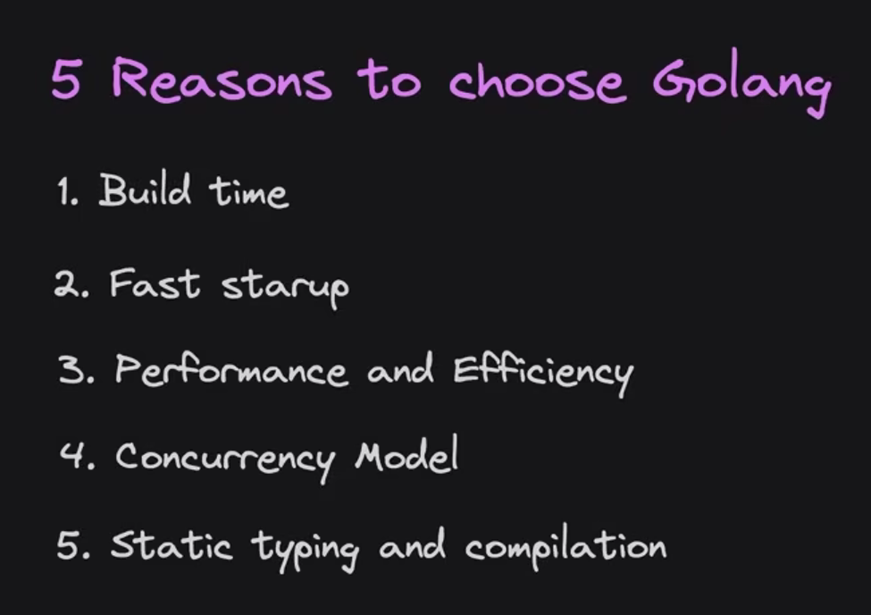

# Introduction to Go

Go (also known as Golang) is an open-source programming language supported by Google. It is a statically typed, compiled language designed for simplicity, high performance, and efficiency, making it ideal for scalable cloud-based systems.

## 👥 History & Creators

Go was designed at **Google** in 2007 and open-sourced in 2009. It was built by three legendary computer scientists:

- **Robert Griesemer** (worked on Java HotSpot VM)
- **Rob Pike** (Unix, UTF-8, Plan 9)
- **Ken Thompson** (B language, C language, Unix)

They created Go to address the challenges of modern software development, such as slow build times, uncontrolled dependencies, and the difficulty of writing efficient concurrent software.

## 🚀 Key Features

- **Simplicity**: Minimalistic syntax that is easy to learn and read.
- **Concurrency**: Built-in support for concurrent programming using **Goroutines** (lightweight threads) and **Channels** (safe communication).
- **Performance**: Compiled to machine code, offering performance comparable to C/C++.
- **Garbage Collection**: Automatic memory management.
- **Strong Standard Library**: Comprehensive "batteries-included" library for networking, HTTP, JSON, and more.
- **Fast Compilation**: Extremely fast build times.

## ⚡ Why is Go Powerful?

Go hits the sweet spot between performance and productivity:

- It has the **speed** of low-level languages like C and C++.
- It has the **readability and ease of use** of high-level languages like Python and JavaScript.
- It is designed for **modern hardware**, maximizing multi-core processor capabilities.



## 🏗️ Notable Apps Built in Go

Many of the world's most critical cloud infrastructure tools are built in Go:

- **Docker**: Containerization platform.
- **Kubernetes**: Container orchestration.
- **Terraform**: Infrastructure as Code tool.
- **Prometheus**: Monitoring and alerting toolkit.
- **Twitch**: Uses Go for high-load systems.
- **Uber**: Uses Go for their geofence lookups and many microservices.

## 📚 Getting Started

To start learning Go, check out these resources:

1.  **[Official Go Tour](https://go.dev/tour/welcome/1)**: A hands-on interactive introduction.
2.  **[Go Documentation](https://go.dev/doc/)**: The official docs.
3.  **[Go by Example](https://gobyexample.com/)**: Hands-on examples of Go concepts.

### Your First Go Program

Save this as `main.go` and run it with `go run main.go`:

```go
package main

import "fmt"

func main() {
    fmt.Println("Hello, World!")
}
```
